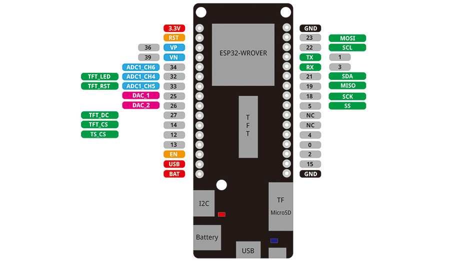

# ESP32 Development Setup

Visual Studio Code: Download & Install Visual Studio Code. Then, install
the PlatformIO extension:\
<https://platformio.org/install/ide?install=vscode>

General: note that we are writing plain C / C++ Code. But don't worry,
it'll be fine

ESP32 Drivers: We will use the following two ESP32 boards:

- LOLIN D32 Pro -> <https://www.wemos.cc/en/latest/d32/d32_pro.html>

- LOLIN D32 -> <https://www.wemos.cc/en/latest/d32/d32.html>

Both support the same development platform called **"Espressif"** and
are compatible with the **Arduino** framework. The Pro-variant
additionally features a MicroSD slot and has a little better specs; but
both have the same PINs to connect sensors.

## Windows Drivers

The boards need a special driver on Windows, so that your computer can
communicate with the on-board CH340C communication chip. Download &
install it:

<https://learn.sparkfun.com/tutorials/how-to-install-ch340-drivers/all#drivers-if-you-need-them>\
(currently version 3.4)\
Direct link:
<https://cdn.sparkfun.com/assets/learn_tutorials/8/4/4/CH341SER.EXE>\
*(Note 1: a newer driver version 3.8 is available on the Chinese page
that you can get translated by your browser:
<http://www.wch.cn/downloads/CH341SER_ZIP.html>)*\
*(Note 2: it is best to disconnect the device during installation and to
re-connect it afterwards. Windows Update might find an optional driver
update later -- it is safe to install this).\
An alternative (currently version 3.5):
<https://www.wemos.cc/en/latest/ch340_driver.html>*

## Mac OS

If you are using the latest version of MacOS, you should not need a
specific driver anymore. For more info, also see here:
<https://community.platformio.org/t/troubleshooting-ch340g-issues-on-macos/9522>

## Configuration & PINs

PIN Configuration: to get to know the various pins of the
microcontroller, check out the layouts. We have two different versions
in use:

Wemos LOLIN D32:
<https://forum.hobbycomponents.com/viewtopic.php?t=2462>

\
*Pinout of the WeMos LOLIN D32, CC-BY License, created by
<https://mischianti.org/esp32-wemos-lolin-d32-high-resolution-pinout-and-specs/>*

Wemos LOLIN D32 Pro: <https://www.wemos.cc/en/latest/d32/d32_pro.html>

*Pinout of the WeMos LOLIN D32 Pro, by Wemos.cc*

Note: Try not to use ports 0, 2 and 12 -- these are "strapping" pins and
should usually be left unconnected while the ESP32 chip is booting.
Otherwise, uploading or running your programs might fail.

Check Connection: connect the board with your PC through a Micro USB
cable. On Windows, open the device manager. You should see a connected
USB-SERIAL CH340 listed under "Ports (COM & LPT)". Note the COM port
number -- in the screenshot below, it's COM4.

Hint: if you don't see your device listed, the cable might not be
suitable for data transfer. Some USB cables only support charging. Try a
different USB cable.

## Connection in Visual Studio Code

Next, open PIO Home in Visual Studio Code. Switch to "Devices". You
should also see the connected device:

Now go to the "Boards" section and search for WEMOS -- you should see
the WEMOS LOLIN D32 (PRO):

Both boards work with the "Espressif 32" platform. Click on the platform
link to get to the corresponding platform and install it.

Now, everything should be in place so that you can start developing for
the board!
