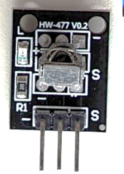
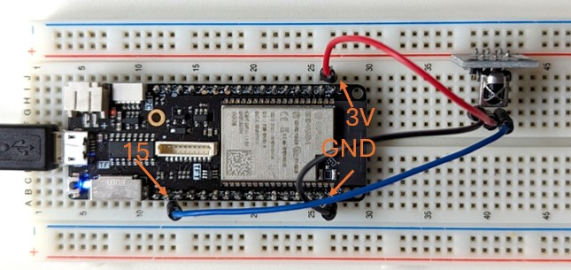
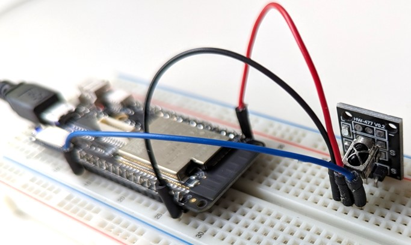
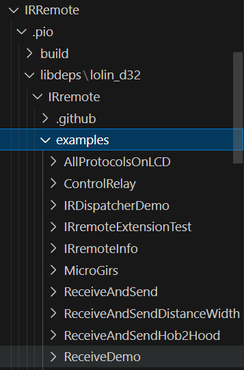
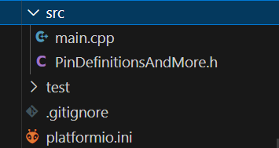

# Infrared Remote - Receiver

Typical remote controls based on IR emitting LEDs (like they are used for TVs) are using pulsed light codes to send commands.
Using the [Arduino-IRRemote library](https://github.com/Arduino-IRremote/Arduino-IRremote) and a [IR-LED sender module (KY-005)](https://sensorkit.joy-it.net/en/sensors/ky-005) and [IR photodiode receiver module (KY-022)](https://sensorkit.joy-it.net/en/sensors/ky-022) we can easily use the remotes for our purposes, or remote control devices that are usually meant to be control from a handheld remote from our microcontroller.

In this example we'll explore how to use the receiver. In the [second part](../IrRemote-Sender/) the sender will be put into action.

## Technical background

TODO

## Setup

### IR Receiver

The IR receiver module ([KY-022](https://sensorkit.joy-it.net/en/sensors/ky-022)) allows for reception of most IR remote control signals from common handheld IR remotes. It consists of a specialised phototransistor that will output the received pulses as voltage, which then can be decoded by the microcontroller. Furthermore the module has an onboard LED that pulses whenever it receives an IR pulse it can decode.



We just need to connect GND (the pin marked with `-`), Vin (middle pin) to the 3V pin and the signal output pin (marked as `S`) to pin number 15 (this is defined in the `PinDefinitionsAndMore.h` file, see below).



## Code

Import the [IRRemote library from the PlatformIO registry](https://registry.platformio.org/libraries/z3t0/IRremote) or directly from [Github](https://github.com/Arduino-IRremote/Arduino-IRremote). 

### Sniffing IR remotes

In the first example we'll just try to figure out for any IR remote we have lying around (e.g. from a TV) what codes it sends. In the [second example](../IrRemote-Sender/)  we'll send out these codes with the IR Transmitter to remote control the IR controllable device from our ESP32.

> **Note**: When you download this repository, all but the last step walkthrough described here are already done. Purpose of the description here is to show you, how you can setup the project yourself.

After importing the library to your project and saving the `platformio.ini` file, you will find the `IRRemote` library code and examples in the `IRRemote/.pio/libdeps/IRremote/examples` path. 



Go to the `SimpleReceiver` example, then

* Select the `SimpleReceiver.ino` file to open it
  * copy the files content to your own `main.cpp` of the project
* Copy the `PinsDefinitionsAndMore.h` file and paste it next to your `main.cpp` file in the projects `src`folder

The result should look like this:



### Adjustments in the code

With this example you can inspect commands from any IR remote the library supports via the serial monitor. In the top-most part protocols from different vendors can selectively be included or, when no specific protocol is selected, decode all supported protocols.

1. Comment out all `#defines` with the supported protocols
  * this should be line 44 should be commented out and should look like this
```cpp
// #define DECODE_NEC
```
2. check on which pin the IRreceiver listens for IR codes from the module. for this, look at line 79 and hover `IR_RECEIVE_PIN`. It reveals that this is pin 15.

  * In case you want to find out where this is defined or even change it to a different pin, just
    * put the cursor in the word `IR_RECEIVE_PIN`
    * hit the F12 key on your keyboard. this will jump to the definition of `IR_RECEIVE_PIN` and open up the `PinDefinitionsAndMore.h` file, which looks like this 
```cpp
#define IR_RECEIVE_PIN          15  // D15
```
   * The `#define` statement is a *[preprocessor](https://en.wikipedia.org/wiki/Preprocessor)*, which acts like a search-and-replace command before compilation. Here `IR_RECEIVE_PIN` will be replaced by `15` all over the code. Feel free to change it to a different number which corresponds to a pin that you want to use for receiving IR codes.
3. connect the pin marked with an `S` (for signal) with the pin you have specified above (`15` if unchanged). Connect the `-` pin to GND on your board and the middle pin of the module to `3V`on your board.
4. Connect the ESP32 to USB and upload the code.

### Serial output

When uploading is done, open the Serial Monitor and see what happens, when you press any buttons on your IR remote control. You should see something like this (your codes will be different depending on the manufacturer of the remote).

The commands shown give you info about the IR protocol used as well as the code how to recreate these code commands.

Now press the buttons that you later want to recreate using the IR Emitter and take note of the commands.

## Inspecting the code

### Setting everything up

Looking at the code the usage of the library is quite simple

First we have to create the `IRRemote.h` header file and the additional `PinDefinitionsAndHeader.h`, which contains certain defines like the `IR_RECEIVE_PIN`.

```cpp
/*
 * This include defines the actual pin number for pins like IR_RECEIVE_PIN, IR_SEND_PIN for many different boards and architectures
 */
#include "PinDefinitionsAndMore.h"
#include <IRremote.hpp> // include the library
```

Note, that by including these headers we'll automatically get a `IRReceiver` object which we first have to configure before using it (which happens on line `79`).

```cpp
// Start the receiver and if not 3. parameter specified, take LED_BUILTIN pin from the internal boards definition as default feedback LED
IrReceiver.begin(IR_RECEIVE_PIN, ENABLE_LED_FEEDBACK);
```

On line 82 we call a function called `printActiveIRProtocols` that takes a reference (`&`) to a serial port, on which the active IR protocols will be printed.

```cpp
printActiveIRProtocols(&Serial);
```

### Using the receiver

In our `loop` function we only listen for newly arrived IR codes. Whenever the `IrReceiver.decode()` returns `true` a new code has arrived and the `if` clause on line 95 will be entered.

Now there are 2 possible cases:

* We received a code the library doesn't recognize (line 100). Then the raw IR codes will be printed to the serial monitor by calling the  `IrReceiver.printIRResultRawFormatted(&Serial, true);` function on line 103.
* or the received code can be recognized (line 105). then
  * we'll tell the receiver to continue listening for commands by calling `IrReceiver.resume()` on line 106
  * and then print the recognized codes on the serial monitor by calling `IrReceiver.printIRResultShort(&Serial)` on line 107

You see that the `IrReceiver` object contains everything we need for decoding and retrieving the received data.

Lines 115 and following show how to easily react on a certain received command. To adjust it for our own remote control we need to replace the command-codes with commands from our own remote control. In our simple example, we'll toggle the board's onbord LED with the remote control. We just need to fill out the blocks with our code:

```cpp
/*
 * Finally, check the received data and perform actions according to the received command
 */
if (IrReceiver.decodedIRData.command == 0x10) {
    // do something
} else if (IrReceiver.decodedIRData.command == 0x11) {
    // do something else
}
```

1. Check which commandset your remote control uses. In the example remote used here, we coud see above that the NEC protocol was used (for your own remote it might be different). It is therefore sufficient to only include the this protocol in the code and therefore uncomment the NEC protocol at line 44 (note that you should do this accordingly. E.g. if you use a Sony command, uncomment line 46 instead).
```cpp
#define DECODE_NEC          // Includes Apple and Onkyo. To enable all protocols , just comment/disable this line.
```
2. Since the onboard-LED was used to signify a received command when configuring the `IrReceiver` on line 79, we'll change this line to disable the LED feedback like this: `IrReceiver.begin(IR_RECEIVE_PIN, false)`. Now we have to setup our onboard LED ourselves to use it. Add the `pinMode(LED_BUILTIN, OUTPUT)` command to your setup to be able to use the LED.
3. Now lets use 2 IR remote buttons to turn on and off the LED. In the if-clauses starting around line 115, modify the blocks to use one button to turn on the LED and another button to turn it off. This could look like this.

```cpp
/*
 * Finally, check the received data and perform actions according to the received command
 */
if (IrReceiver.decodedIRData.command == 0x10) {
    digitalWrite(LED_BUILTIN, LOW);
} else if (IrReceiver.decodedIRData.command == 0x11) {
    digitalWrite(LED_BUILTIN, HIGH);
}
```

Congratulations, you can now use almost any IR remote to control your setup!
