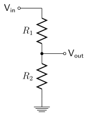

# Light Dependent Resistors (LDR)

**Example:** *LDR*

The LDR changes its resistance depending on the brightness. Try
measuring its resistance using the multimeter when it is dark (put your
finger on the LDR) or when it is bright (remove the finger or hold it
close to a light). Note the minimum and maximum resistance value of your
sensor and environment.


As such, to get the brightness, we essentially need to find out the
resistance value of the LDR.

However, most boards (including the ESP32 or Arduino) cannot measure a
resistance in $Ω$ like a multimeter can. Therefore, you need to use a
**voltage divider**. The available input voltage (in our case $3.3V$) is
always "consumed" by the components in your circuit, depending on the
resistance of this component: the higher the resistance, the higher the
voltage drop.

To build a voltage divider, you use two resistors: one reference
resistor with a value that is known to you, and a second variable
resistor (in our case, the LDR). Then you measure the voltage in the
middle of both components. As a result, you know:

- The input voltage (3.3V).
- The resistance of the reference resistor.
- The voltage measured between both components.

Our setup is a simple voltage divider, where one resistor value $R_{1}$ and
the $3.3V$ input $V_{in}$ are known. The output voltage $V_{out}$ is measured
through the ESP32 pin 25. Using these three data points, we can infer
the resistance of the LDR ($R_{2}$).



First, convert the measurement of the LDR board to a voltage. An analog
input port of the ESP32 will be $0$ for $0V$ and $4096$ for $3.3V$. It
splits up the voltage range into $4096$ individual steps – that is the
accuracy we have.

An example: we use $R_{1}=10.000Ω$ if the ESP32 returns the value $a=1000$
on the analog input pin, that means:

$$V_{out} = \frac{V_{in}}{4096.0}*a = \frac{3.3V}{4096}*1000 = 0.81V$$

Next, we can use the formula of the voltage divider to calculate the
resistance of the LDR ($R_{2}$):

$$V_{out} = \frac{R_{2}}{R_{1} + R_{2}}*V_{in}$$

Solving for $R_{2}$ gives (see
<https://en.wikipedia.org/wiki/Voltage_divider#Resistive_divider> ):

$$R_{2} = R_{1} * \frac{1}{\frac{V_{in}}{V_{out}} - 1} = 10000\Omega * \frac{1}{\frac{3.3V}{0.73V} - 1} = 2840\Omega$$

If you have a data sheet of the LDR, you could then use this resistance
value to convert it to LUX, a measurement of the brightness of the room.

Both $R_{1}$ and $R_{2}$ need to be in some good relationship to each other,
so that our limited accuracy of differentiating $4096$ different voltage
levels is used. For example, if your $R_{1}$ is huge (several megaohms), a
small difference in the resistance of the LDR will not have a noticeable
impact on the voltage division.

How to get to a good value for $R_{1}$? A good approach is to measure the
minimum and maximum $Ω$ you want to consider. Then put these values into
the Axel Benz Formula 🡪

$$R_{ref} = \sqrt{R_{\min} * R_{\max}} = \sqrt{870\Omega * 4000\Omega} = 1865\Omega$$

Now that you know the theoretical basics, it is time to build it:


The code to measure the raw value returned by an analog input port uses
the `analogRead(pin)` function, which returns a value between $0..4096$:

```c++
#include <Arduino.h>

const int pin_ldr = 25;

void setup()
{
  Serial.begin(115200);
}

void loop()
{
  int ldr_val = analogRead(pin_ldr);
  Serial.print("LDR raw value: ");
  Serial.println(ldr_val);
  delay(100);
}
```

**Exercise:** try converting the returned value into a voltage!
